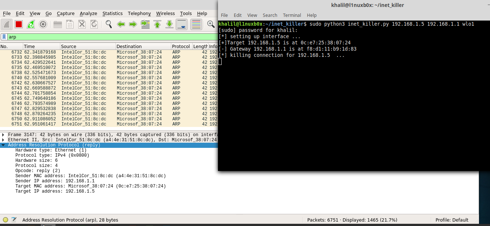
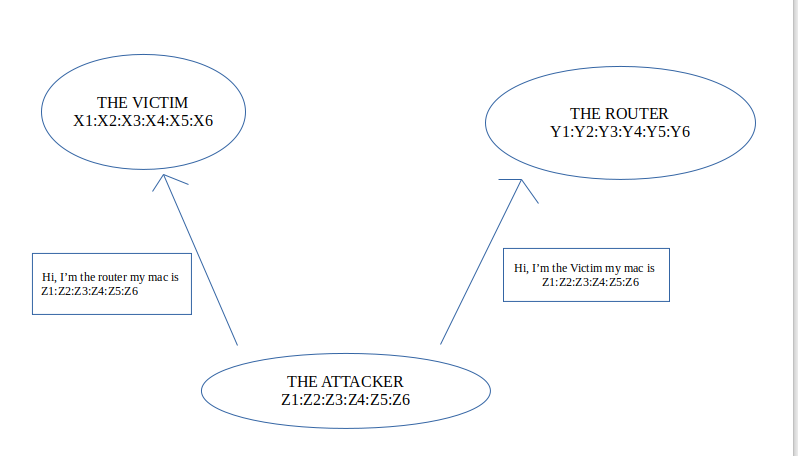
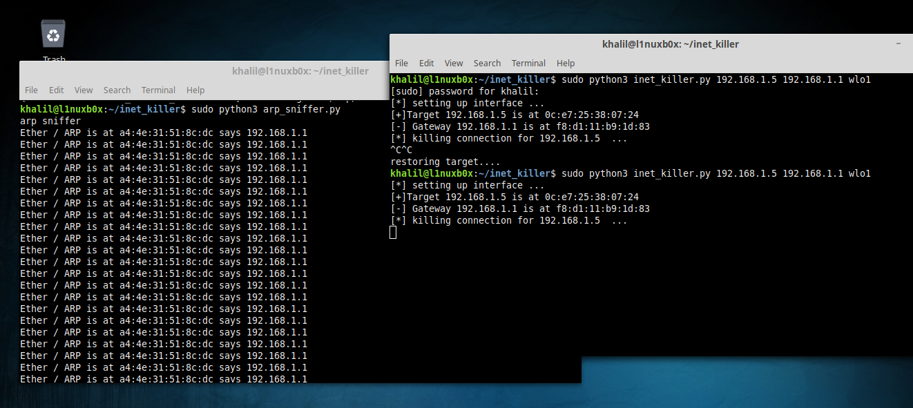

# Inet_killer (Internet Killer) :x:

Proof of Concept of connection killing with ARP spoofing.
```
In computer networking, ARP spoofing, ARP cache poisoning, or ARP poison routing, is a technique 
by which an attacker sends (spoofed) Address Resolution Protocol (ARP) messages onto a local area 
network. Generally, the aim is to associate the attacker's MAC address with the IP address of another
host, such as the default gateway, causing any traffic meant for that IP address to be sent to the
attacker instead.
```


## 1.Concept of attack

  - Get MAC address of Target & Gateway by Sending ARP request ( If the script failed to get MAC addresses, the script will exit).
  - Dump the router's ARP cache by sending Multiple continuous Fake ARP packets.
  Make The router believing that the attacker is the victim by swaping MAC addresses. And also make the victim believe that the attacker is router (Its like a MITM attack).
  The attacker's MAC addresse is sent to both: The router & The victim,
  The can be identified if someone is watching the Network traffic, so you have the options to edit the script and send a random MAC instread of the attaker's MAC.
  - When (CTRL + C) The connection is restored, the appropriate MACs are sent.

  
  
## 2.Requirement (Tested on Linux Mint 19.1 Cinnamon)
  - Scapy
  - Python3

## 3.Usage

```
inet_killer : internet connection killer

usage : sudo python3 inet_killer.py [target] [gateway] [interface]

Options :
  target : your target ip address

  gateway : your gateway ip address

  interface : your network interface


Example : sudo python3 inet_killer.py 192.168.1.156 192.168.1.1 wlan0
```
Run as root (sudo):
```
sudo python3 inet_killer.py [target] [gateway] [interface]
```
Full Video of Usage:
[](https://asciinema.org/a/236712)

If you don't have Wireshark, run `arp_sniffer.py` as root.
arp_sniffer.py capture only ARP packets.



## References
  * https://en.wikipedia.org/wiki/ARP_spoofing
  * https://en.wikipedia.org/wiki/Address_Resolution_Protocol
  * https://scapy.net/
  * https://www.amazon.com/Black-Hat-Python-Programming-Pentesters/dp/1593275900
